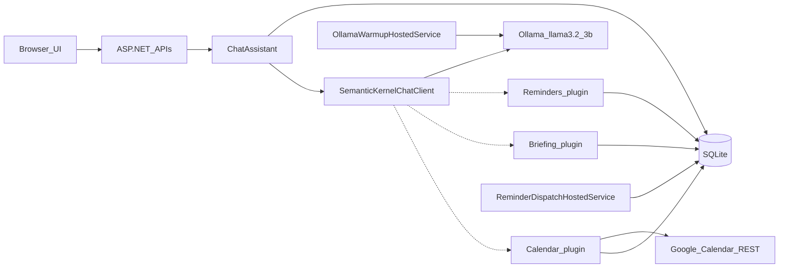

# Semantic Kernel Assistant — Technical Documentation

This document describes **what the application does** and **how the main logic works**. For install and run commands, see [README.md](../README.md).

## 1. Purpose

Semantic Kernel Assistant is a **local-first** web chat app:

- **ASP.NET Core** (.NET 10) hosts the UI and APIs.
- **Microsoft Semantic Kernel** orchestrates chat and optional tool calls.
- **Ollama** runs **`llama3.2:3b`** on the same machine (no cloud API keys).
- **SQLite** stores conversations, messages, reminders, and optional Google OAuth tokens. The database file and schema are created automatically on startup.

The product is meant as a private assistant demo: chat, streaming replies, local reminders, a daily briefing, optional browser notifications, and **optional** Google Calendar meeting invitations. Google is not required. An empty `Google:ClientId` keeps the app in local-only mode (reminders and briefing still work).

## 2. What it can do

| Capability | Behavior |
| --- | --- |
| Multi-conversation chat | Create, list, and switch conversations; history is persisted. |
| Streaming replies | The UI shows tokens as Ollama generates them. |
| Local reminders | Create, list, complete, and cancel via chat (Semantic Kernel plugin) or HTTP APIs. |
| Due reminders | A background worker marks due items as `fired`; the sidebar, toast, and optional browser `Notification` alert the user. |
| Daily briefing | Semantic Kernel `Briefing` plugin summarizes overdue items and reminders due today. |
| Google Calendar invites | Semantic Kernel `Calendar` plugin creates a Google Calendar event with attendees and `sendUpdates=all`, which causes Gmail to email the invitation. |
| Ollama readiness | Status API and UI card report whether the model is installed and reachable. |
| Google connection | Sidebar card reports OAuth status; Connect / Disconnect when a ClientId is configured. |
| Automatic storage | `App_Data/assistant.db` is created; EF Core migrations run at startup. |

**Local reminders are not a calendar.** They live only in this app’s SQLite database. Meeting invitations use Google Calendar REST (not Microsoft Graph, Outlook, SMTP, or the Gmail send API).

## 3. Architecture



The UI is static files under `wwwroot` (`index.html`, `app.js`, `styles.css`). APIs live under `/api`. Semantic Kernel is registered per request with the `Reminders`, `Briefing`, and `Calendar` plugins attached to a `Kernel` instance.

Background services:

- **`OllamaWarmupHostedService`** — preloads the model and periodically keeps it in memory.
- **`ReminderDispatchHostedService`** — every 10 seconds, marks pending reminders whose `DueAtUtc` has passed as `fired`.

## 4. Core logic

### 4.1 Chat pipeline

`ChatAssistant` (`Services/ChatAssistant.cs`) is the application use case:

1. Validate the user text (required, max 4,000 characters).
2. Persist the **user** message.
3. Reload the conversation with messages in time order.
4. Stream completion chunks from `IAiChatClient` and forward them to the HTTP/UI callback.
5. Persist **one** assembled **assistant** message.

The first user message in a conversation titled “New conversation” becomes the conversation title (truncated to 120 characters).

### 4.2 Semantic Kernel and Ollama

`SemanticKernelChatClient` (`Services/AiChatClient.cs`) builds a Semantic Kernel `ChatHistory`:

1. Adds the configured system prompt.
2. Sends only the **most recent 12 messages** (configurable) to keep CPU load down.
3. Calls `GetStreamingChatMessageContentsAsync` with `OllamaPromptExecutionSettings`:
   - `num_ctx` = 2048
   - `NumPredict` = 256 (output token cap)
4. Yields non-empty content chunks to the caller.

**Tools are not always on.** The kernel is passed into the completion call only when the latest user message looks like:

- a reminder/alarm request (`remind`, `alarm`)
- a briefing request (`briefing`, `agenda`, `what do i have today`, `what's on today`)
- a calendar/invite request (`invite`, `invitation`, `gmail`, `calendar`, `meeting`, `schedule`, `attendee`)

That avoids extra tool-planning round trips on ordinary Q&A, which were slow on CPU-only `llama3.2:3b`.

The system prompt tells the model to use **Reminders** only for local sidebar alarms, **Briefing** for today’s local reminder agenda, and **Calendar CreateMeetingInvite** for Gmail/Google Calendar invitations. It must only confirm an invite after the tool succeeds, and must never invent that an email was sent.

If the model returns no text, the client substitutes a short fallback string so the UI still gets a message.

The Ollama connector package is experimental (`SKEXP0070`). Application code talks to `IAiChatClient` so tests can use a fake client without Ollama.

### 4.3 Reminders

When tools are enabled, Semantic Kernel may call `ReminderPlugin` (`Plugins/ReminderPlugin.cs`):

| Function | Role |
| --- | --- |
| `CreateReminder` | Parse due time, insert a `pending` row |
| `ListReminders` | Upcoming pending plus recently fired |
| `CompleteReminder` | Status → `completed` |
| `CancelReminder` | Status → `cancelled` |

`ReminderDueParser` accepts ISO-8601 datetimes and relative phrases such as `in 10 minutes`, `tomorrow 9am`, or `today 3pm`. Dates and times without an explicit offset are interpreted as India Standard Time (`Asia/Kolkata`), while values with an explicit ISO offset retain that offset. Due times must be in the future and are stored as UTC `DateTime`. The sidebar converts stored UTC values back to IST for display.

`ReminderStore` is the persistence layer. The dispatcher does not send email or write to an external calendar; it only updates status so the UI can poll `/api/reminders`.

When a reminder first appears as `fired`, `wwwroot/app.js` still shows the in-app toast. If the Notifications API exists, it requests permission once when permission is `default`, then shows a browser notification when permission is `granted`. The Reminders panel has an **Enable notifications** button that reports granted or blocked state and sends a test notification immediately after permission is granted.

### 4.4 Daily briefing

`BriefingPlugin.GetDailyBriefing` (`Plugins/BriefingPlugin.cs`) calls `IBriefingService.GetTodayAsync`. `BriefingService` reads the same reminder list as the sidebar and splits items by local calendar date (from `IClock.Now`):

- **Due today** — due date equals today
- **Overdue** — pending or fired, due date before today
- Counts for pending, due-today, and overdue

It does not read Outlook or Google Calendar.

### 4.5 Google Calendar invitations

Gmail meeting invitations are created by inserting a **Google Calendar event with attendees**. The Calendar API query `sendUpdates=all` tells Google to email guests. The app does not send SMTP mail and does not call the Gmail send API.

`CalendarPlugin` (`Plugins/CalendarPlugin.cs`, kernel name `Calendar`):

| Function | Role |
| --- | --- |
| `CreateMeetingInvite` | Parse start time, validate emails, POST a Calendar event |
| `ListTodayEvents` | List events on the local calendar day |

`CreateMeetingInvite` uses `ReminderDueParser` for `startAt`, defaults duration to 30 minutes, and requires at least one comma-separated address containing `@`. Success JSON includes `message: "Invitation sent via Google Calendar."` Errors, including **Google not connected**, are `{"error":"..."}` so the model cannot treat a failure as success.

`CalendarInviteService` calls:

`POST https://www.googleapis.com/calendar/v3/calendars/primary/events?sendUpdates=all`

with Bearer access token, `summary` / `description`, local `start`/`end` (`dateTime` + time zone), and `attendees: [{ "email": "..." }]`. If Google is not connected it throws `InvalidOperationException("Google account not connected. Click Connect Google in the sidebar.")`.

OAuth is authorization-code with `access_type=offline` and `prompt=consent`. Tokens are stored in SQLite (`OAuthTokens`, provider `Google`), one row per provider. Access tokens are refreshed when `ExpiresAtUtc` is before `UtcNow + 2 minutes`. Access tokens, refresh tokens, and email bodies are never logged.

Google is optional. Empty `Google:ClientId` means `IsConfigured` is false: Connect returns HTTP 503, chat tools return a not-connected error, and local reminders/briefing keep working.

#### Google Cloud Console setup

1. Create an OAuth client of type **Web application**.
2. Add authorized redirect URI `http://localhost:5118/api/auth/google/callback`.
3. Enable the **Google Calendar API**.
4. Add your Google account as a **test user** while the OAuth consent screen is in testing.
5. Request scopes: `openid`, `email`, and `https://www.googleapis.com/auth/calendar.events`.

Store credentials in User Secrets (never in `appsettings.json` or git):

```powershell
dotnet user-secrets set "Google:ClientId" "<client-id>" --project .\src\SemanticKernelAssistant.Web
dotnet user-secrets set "Google:ClientSecret" "<client-secret>" --project .\src\SemanticKernelAssistant.Web
```

#### Demo

1. Click **Connect** on the Google Calendar sidebar card and finish Google consent.
2. Chat: `Invite teammate@gmail.com tomorrow at 10am for Project review for 30 minutes`

### 4.6 Model warm-up

`OllamaModelWarmer` POSTs Ollama’s `/api/generate` with an **empty prompt**, `stream: false`, and `keep_alive` derived from `KeepAliveMinutes` (default 30). Warm-up failures are logged and **do not stop** the web app. A periodic timer (default every 4 minutes) repeats the request so idle unload is less likely.

### 4.7 Streaming UI

The chat page POSTs to `/api/conversations/{id}/messages/stream`. The response is **NDJSON** (`application/x-ndjson`):

| Event `type` | Meaning |
| --- | --- |
| `delta` | Incremental assistant text |
| `complete` | Final saved message payload |
| `error` | Validation, missing conversation, or Ollama unavailable |

`wwwroot/app.js` appends `delta` chunks to the assistant bubble, then refreshes conversations and reminders. A non-streaming POST `/messages` still exists for simple clients.

The left sidebar shows the Ollama status card, then a **Google Calendar** card (`GET /api/auth/google/status`) with Connect (`GET /api/auth/google/login`) and Disconnect (`POST /api/auth/google/logout`). If ClientId is empty, Connect is disabled with title `Set Google ClientId in User Secrets first`. The Reminders panel stays visible on desktop.

## 5. Data model

EF Core `AssistantDbContext` maps four tables. Migrations run with `Database.MigrateAsync()` before the app accepts traffic.

**Conversations**

- `Id`, `Title` (max 120), `CreatedAtUtc`, `UpdatedAtUtc`
- Indexed on `UpdatedAtUtc` (list newest first)

**Messages**

- `Id`, `ConversationId` (cascade delete), `Role` (`user` / `assistant`), `Content` (max 16,000), `CreatedAtUtc`
- Indexed on `(ConversationId, CreatedAtUtc)`

**Reminders**

- `Id`, `Title` (max 200), `Notes` (optional, max 2,000), `DueAtUtc`, `Status` (`pending` / `fired` / `completed` / `cancelled`), `CreatedAtUtc`, `FiredAtUtc`
- Indexed on `(Status, DueAtUtc)`

**OAuthTokens**

- `Id`, `Provider` (unique, value `Google`), `AccessToken`, `RefreshToken`, `ExpiresAtUtc`, `UpdatedAtUtc`
- One row per provider

Default file path: `src/SemanticKernelAssistant.Web/App_Data/assistant.db` (gitignored).

## 6. APIs and configuration

### HTTP APIs

| Method | Path | Purpose |
| --- | --- | --- |
| GET | `/api/status` | Ollama endpoint, model id, available flag |
| GET/POST | `/api/conversations` | List / create |
| GET | `/api/conversations/{id}/messages` | History |
| POST | `/api/conversations/{id}/messages` | Full reply (JSON) |
| POST | `/api/conversations/{id}/messages/stream` | NDJSON stream |
| GET | `/api/reminders` | Pending and recently fired |
| POST | `/api/reminders/{id}/complete` | Complete |
| POST | `/api/reminders/{id}/cancel` | Cancel |
| GET | `/api/auth/google/login` | 302 to Google authorize (`access_type=offline`, `prompt=consent`); 503 if ClientId empty |
| GET | `/api/auth/google/callback` | Exchange code, save tokens, 302 to `/?google=connected` |
| POST | `/api/auth/google/logout` | Delete the Google token row |
| GET | `/api/auth/google/status` | `{ configured, connected, message }` |

Typical errors: `400` invalid message, `404` missing conversation/reminder, `503` Ollama down or Google not configured.

Named HttpClients: `GoogleOAuth` (timeout 30s, `https://oauth2.googleapis.com/`) and `GoogleCalendar` (timeout 30s, `https://www.googleapis.com/calendar/v3/`).

### Settings (`Assistant` section)

| Key | Default | Role |
| --- | --- | --- |
| `Endpoint` | `http://localhost:11434` | Ollama base URL |
| `Model` | `llama3.2:3b` | Chat model |
| `ContextSize` | 2048 | Ollama `num_ctx` |
| `MaximumOutputTokens` | 256 | Generation cap |
| `MaximumHistoryMessages` | 12 | Messages sent to the model |
| `KeepAliveMinutes` | 30 | Ollama keep-alive |
| `WarmupIntervalMinutes` | 4 | Warm-up timer |
| `SystemPrompt` | (in `appsettings.json`) | Assistant, reminder, briefing, and calendar instructions |

### Settings (`Google` section)

| Key | Default | Role |
| --- | --- | --- |
| `ClientId` | `""` | OAuth web client id; empty = local-only |
| `ClientSecret` | `""` | OAuth secret; set via User Secrets only |
| `RedirectUri` | `http://localhost:5118/api/auth/google/callback` | Must be an absolute URI |
| `Scopes` | `openid email https://www.googleapis.com/auth/calendar.events` | OAuth scopes |

`Database:Path` is relative to the web project content root unless rooted.

## 7. Project layout

```text
SemanticKernelAssistant.slnx
global.json                          # SDK 10.0.303, latestPatch
src/SemanticKernelAssistant.Web/
  Program.cs                         # DI, migrate, endpoints
  Data/                              # Entities, DbContext, migrations
  Services/                          # Chat, SK client, stores, Google, warmup
  Plugins/ReminderPlugin.cs
  Plugins/BriefingPlugin.cs
  Plugins/CalendarPlugin.cs
  Background/ReminderDispatchHostedService.cs
  wwwroot/                           # Chat UI
tests/SemanticKernelAssistant.Tests/ # SQLite + fake AI + HttpMessageHandler stubs; no Ollama or live Google login
docs/TECHNICAL.md                    # This file
```

Tests cover persistence, reminder parsing/plugin, daily briefing, history trimming, tool gating (including calendar invites), Calendar plugin errors, OAuth refresh, Calendar POST stubs, streaming persistence, and warm-up failure tolerance. Live generation still requires a running Ollama instance with the configured model pulled. Live invitations require User Secrets plus Connect Google.
